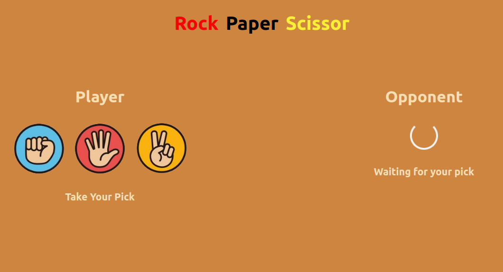
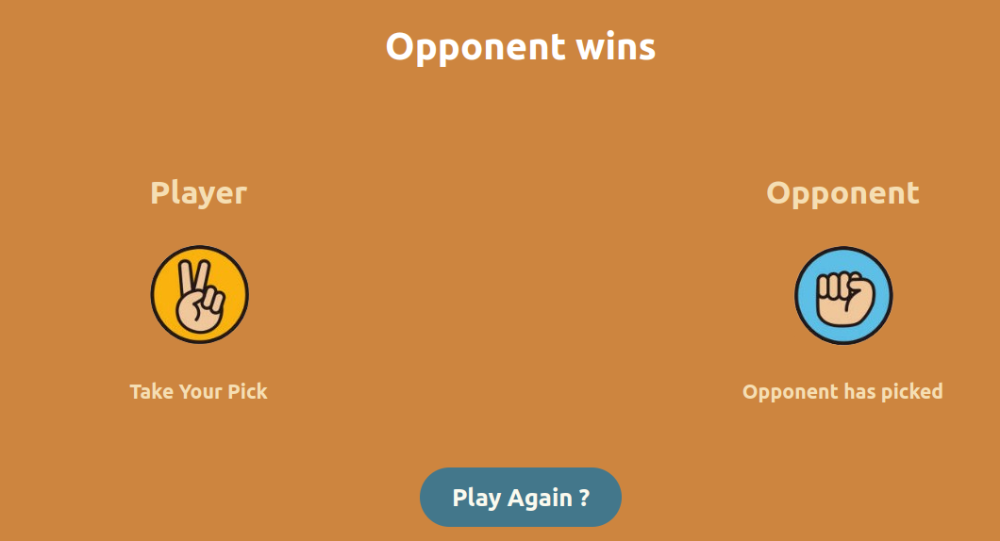

# Rock Paper Scissors Game

## Overview
This is a simple Rock Paper Scissors game built using React. It allows users to play the classic Rock Paper Scissors game against the computer.

## Features
- User can select Rock, Paper, or Scissors.
- Computer randomly selects its move.
- Results are displayed indicating whether the user won, lost, or it's a draw.
- Reset button to start a new game.

## Technologies Used
- React
- HTML/CSS
- JavaScript

## How to Play
1. Clone the repository to your local machine.
2. Navigate to the project directory.
3. Install dependencies using npm or yarn: `npm install` or `yarn install`.
4. Start the development server: `npm start` or `yarn start`.
5. Open your browser and navigate to `http://localhost:3000` to play the game.

## Screenshots

## Demo
You can try out the game [here](https://shrabya35.github.io/Rock-paper-scissors/).

## ⭐️ Thank You 
Contributions are welcome! If you find any bugs or have suggestions for improvements, please open an issue or submit a pull request.

If you find this project useful or interesting, please consider giving it a star! 

Thank you for your support! 🚀

